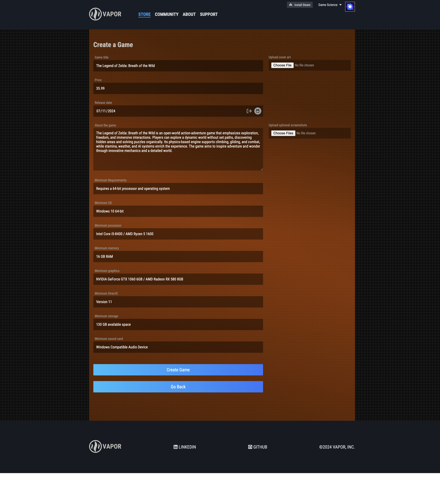

# Vapor

Welcome to Vapor, a website inspired by the gaming platform Steam. Vapor is a versatile platform designed for gamers who enjoy a broad spectrum of games, from mainstream blockbusters to niche indie titles. Whether you're a fan of the latest major releases or love discovering and supporting smaller, independent developers, Vapor provides an engaging space to explore and discuss your favorite games.


## Play Your Favorite Games

On Vapor, you take on the role of both developer and user. You can create, edit, and manage your own games directly on our platform. Post your games, handle all the details, and interact with reviews to see what others think. While playing games is not available, Vapor provides all the tools you need to develop and showcase your work. Stay tuned for future updates that will expand your capabilities.


## Live Site URL

https://vapor-al92.onrender.com

## Live Site Preview

### Vapor Homepage


### Game Details


### Sign In


### Uesr Hub


### Create Game



### Edit Game


### Checkout Process


## Key Features

- **Backend with Flask and SQLAlchemy**: Implemented robust backend routes using Flask and SQLAlchemy. This setup ensures efficient data handling, secure API endpoints, and seamless interactions between the frontend and the database, providing a solid foundation for the platform's functionality.
- **Dynamic UI powered by React and Redux**: Developed a responsive and visually compelling use interface utilizing React and Redux.Implemented modern UX/UI principles to create a smooth, intuitive user experience with efficient state management and easy navigation throughout the platform.
- **Full CRUD Functionality for Games and Reviews**: Developed comprehensive CRUD operations for game and review management management, allowing users to create, read, update, and delete their own games and reviews within the platform (including multiple images).
- **Wishlist Management**: Seamlessly integrated into the user experience, users can easily add and manage their favorite games through a personalized wishlist feature. This functionality allows users to save games they are interested in, providing a convenient way to keep track of their favorites and revisit them later.
- **"Purchase"** games with ease by adding it to your shopping cart and going through the checkout process.


## Future Features

- **Genre-Based Filtering**: Includes a dynamic filter feature that allows users to search and browse games by genre, making it easy to discover games and developers that match their musical preferences.


## Technologies Used


## Getting started

1. Clone this repository (main branch).

2. Install dependencies.

   ```bash
   pipenv install -r requirements.txt
   ```

3. Create a **.env** file based on the example with proper settings for your development environment.

4. Make sure the SQLite3 database connection URL is in the **.env** file.

5. This starter organizes all tables inside the `flask_schema` schema, defined by the `SCHEMA` environment variable. Replace the value for `SCHEMA` with a unique name, **making sure you use the snake_case convention.**

6. Get into your pipenv shell, migrate your database, seed your database, and run your Flask app:

   ```bash
   pipenv shell
   ```

   ```bash
   flask db upgrade
   ```

   ```bash
   flask seed all
   ```

   ```bash
   flask run
   ```

7. The React frontend has no styling applied. Copy the **.css** files from your Authenticate Me project into the corresponding locations in the **react-vite** folder to give your project a unique look.

8. To run the React frontend in development, `cd` into the **react-vite** directory and run `npm i` to install dependencies. Next, run `npm run build` to create the `dist` folder. The starter has modified the `npm run build` command to include the `--watch` flag. This flag will rebuild the **dist** folder whenever you change your code, keeping the production version up to date.

# API Documentation - Backend API Routes

## USER AUTHENTICATION/AUTHORIZATION

### All endpoints that require authentication

All endpoints that require a current user to be logged in.

- Request: endpoints that require authentication
- Error Response: Require authentication

  - Status Code: 401
  - Headers:
    - Content-Type: application/json
  - Body:
    ```json
    {
        "errors": {
            "message": "Unauthorized"
        }
    }
    ```

### All endpoints that require proper authorization

All endpoints that require authentication and the current user does not have the correct role(s) or permission(s).

- Request: endpoints that require proper authorization
- Error Response: Require proper authorization

  - Status Code: 403
  - Headers:
    - Content-Type: application/json
  - Body:
    ```json
    {
      "error": "Forbidden"
    }
    ```

### Get the current user

Returns the information about the current user that is logged in.

- Require Authentication: false
- Request

  - Method: GET
  - URL: /api/session
  - Headers: none
  - Body: none

- Successful Response when there is a logged in user

  - Status Code: 200
  - Headers:
    - Content-Type: application/json
  - Body:
    ```json
    {
        "user": {
            "id": 1,
            "username": "JohnSmith",
            "email": "john.smith@gmail.com",
            "developer_name": "JohnSmith",
            "avatar": "http://website.com/image.jpg",
            "about": "Lorem ipsum dolor sit amet, consectetur adipiscing elit. Sed do eiusmod tempor incididunt ut labore et dolore magna aliqua."
        }
    }
    ```

- Successful Response when there is no logged in user

  - Status Code: 200
  - Headers:
    - Content-Type: application/json
  - Body:
    ```json
    {
        "user": null
    }
    ```

### Log in a user

Logs in a current user with valid credentials and returns the current user's information.

- Require Authentication: false
- Request

  - Method: POST
  - URL: /api/auth/login
  - Headers:
    - Content-Type: application/json
  - Body:
    ```json
    {
        "credential": "john.smith@gmail.com",
        "password": "secret password"
    }
    ```

- Successful Response

  - Status Code: 200
  - Headers:
    - Content-Type: application/json
  - Body:
    ```json
   {
        "user": {
            "id": 1,
            "username": "JohnSmith",
            "email": "john.smith@gmail.com",
            "developer_name": "JohnSmith",
            "avatar": "http://website.com/image.jpg",
            "about": "Lorem ipsum dolor sit amet, consectetur adipiscing elit. Sed do eiusmod tempor incididunt ut labore et dolore magna aliqua."
        }
    }
    ```

- Error Response: Invalid credentials

  - Status Code: 401
  - Headers:
    - Content-Type: application/json
  - Body:

    ```json
    {
        "email": [
            "Email provided not found"
        ],
        "password": [
            "No such user exists"
        ]
    }
    ```

- Error response: Body validation errors

  - Status Code: 400
  - Headers:
    - Content-Type: application/json
  - Body:
    ```json
    {
        "message": "Bad Request",
        "errors": {
            "credential": "Email is required",
            "password": "Password is required"
        }
    }
    ```

### Sign up a user

Creates a new user, logs them in as the current user, and returns the current user's information.

- Require Authentication: false
- Request

  - Method: POST
  - URL: /api/auth/signup
  - Headers:
    - Content-Type: application/json
  - Body:
    ```json
    {
        "user": {
              "id": 1,
              "username": "JohnSmith",
              "email": "john.smith@gmail.com",
              "developer_name": "JohnSmith",
              "avatar": "http://website.com/image.jpg",
              "about": "Lorem ipsum dolor sit amet, consectetur adipiscing elit. Sed do eiusmod tempor incididunt ut labore et dolore magna aliqua."
        }
    }
    ```

- Successful Response

  - Status Code: 200
  - Headers:
    - Content-Type: application/json
  - Body:
    ```json
    {
        "user": {
            "id": 1,
            "username": "JohnSmith",
            "email": "john.smith@gmail.com",
            "developer_name": "JohnSmith",
            "avatar": "http://website.com/image.jpg",
            "about": "Lorem ipsum dolor sit amet, consectetur adipiscing elit. Sed do eiusmod tempor incididunt ut labore et dolore magna aliqua."
        }
    }
    ```

- Error response: User already exists with the specified email

  - Status Code: 500
  - Headers:
    - Content-Type: application/json
  - Body:
    ```json
    {
        "message": "Email is already in use.",
        "errors": {
            "email": "Email address is already in use."
        }
    }
    ```

- Error response: User already exists with the specified username

  - Status Code: 500
  - Headers:
    - Content-Type: application/json
  - Body:
    ```json
    {
        "message": "Username is already in use.",
        "errors": {
            "username": "Username is already in use"
          }
    }
    ```

- Error response: Body validation errors

  - Status Code: 400
  - Headers:
    - Content-Type: application/json
  - Body:
    ```json
    {
        "message": "Bad Request",
        "errors": {
            "email": "Invalid email",
            "username": "Username is required",
            "password_name": "Password is required",
            "confirm_password": "Confirm password is required",
      }
    }
    ```

### Log out a user

Logs out the current user.

- Require Authentication: false
- Request

  - Method: GET
  - URL: /api/auth/logout
  - Headers: none
  - Body: none

- Successful Response

  - Status Code: 200
  - Headers:
    - Content-Type: application/json
  - Body:
    ```json
    {
        "message": "User logged out"
    }
    ```


## Game Routes

### Get all games

Returns all the games.

- Require Authentication: false
- Request

  - Method: GET
  - URL: /api/games/all
  - Headers: none
  - Body: none

- Successful Response

  - Status Code: 200
  - Headers:
    - Content-Type: application/json
  - Body:
    ```json
    [
      {
      "categories": [
          {
            "id": 6,
            "name": "Role Playing"
          },
          {
            "id": 10,
            "name": "MMORPG"
          },
          {
            "id": 25,
            "name": "Story_Rich"
          }
        ],
        "cover_art": [
          {
            "cover_art_url": "https://vapor-ac.s3.amazonaws.com/01_black_myth_wukong/cover-art-wukong.png",
            "filename": "cover_art_0000000000000.png",
            "game_id": 1,
            "game_title": "Black Myth Wukong",
            "id": 1
          }
        ],
        "description": "Black Myth: Wukong is an action RPG rooted in Chinese mythology. The story is based on Journey to the West, one of the Four Great Classical Novels of Chinese literature. You shall set out as the Destined One to venture into the challenges and marvels ahead, to uncover the obscured truth beneath the veil of a glorious legend from the past.",
        "id": 1,
        "min_directx": "Version 11",
        "min_graphics": "NVIDIA GeForce GTX 1060 6GB / AMD Radeon RX 580 8GB",
        "min_memory": "16 GB RAM",
        "min_os": "Windows 10 64-bit",
        "min_processor": "Intel Core i5-8400 / AMD Ryzen 5 1600",
        "min_requirements": "Requires a 64-bit processor and operating system",
        "min_sound_card": "Windows Compatible Audio Device",
        "min_storage": "130 GB available space",
        "price": "59.99",
        "release_date": "Mon, 19 Aug 2024 00:00:00 GMT",
        "reviews": [
          {
            "created_at": "Sat, 14 Sep 2024 05:08:11 GMT",
            "description": "Honestly I kept my expectations low because it seemed too good to be true especially being the first game from the studio but they nailed it. The combat I would say is more akin to something like God of War rather than a soulslike. It feels great to play, very responsive, a lot of different ways to play. The graphics are fantastic and the game runs well, have not had any crashes so far.",
            "game_id": 1,
            "id": 1,
            "thumbs_down": false,
            "thumbs_up": true,
            "updated_at": "Sat, 14 Sep 2024 05:08:11 GMT",
            "user_id": 2,
            "username": "Blizzard Entertainment, Inc."
          }
        ],
        "screenshots": [
          {
            "game_id": 1,
            "id": 1,
            "screenshot_url": "https://vapor-ac.s3.amazonaws.com/01_black_myth_wukong/screenshot1.jpg"
          },
          {
            "game_id": 1,
            "id": 2,
            "screenshot_url": "https://vapor-ac.s3.amazonaws.com/01_black_myth_wukong/screenshot2.jpg"
          }
        ],
        "title": "Black Myth Wukong",
        "trailer": null,
        "user": {
          "user_id": 1,
          "username": "Game Science"
        }
      }
    ]
    ```

### Get details of a game from an id

Returns the details of a game specified by its id.

- Request

  - Method: GET
  - URL: /api/games/:gameId/get
  - Headers: none
  - Body: none

- Successful Response

  - Status Code: 200
  - Headers:
    - Content-Type: application/json
  - Body:
    ```json
    [
      {
      "categories": [
          {
            "id": 6,
            "name": "Role Playing"
          },
          {
            "id": 10,
            "name": "MMORPG"
          },
          {
            "id": 25,
            "name": "Story_Rich"
          }
        ],
        "cover_art": [
          {
            "cover_art_url": "https://vapor-ac.s3.amazonaws.com/01_black_myth_wukong/cover-art-wukong.png",
            "filename": "cover_art_0000000000000.png",
            "game_id": 1,
            "game_title": "Black Myth Wukong",
            "id": 1
          }
        ],
        "description": "Black Myth: Wukong is an action RPG rooted in Chinese mythology. The story is based on Journey to the West, one of the Four Great Classical Novels of Chinese literature. You shall set out as the Destined One to venture into the challenges and marvels ahead, to uncover the obscured truth beneath the veil of a glorious legend from the past.",
        "id": 1,
        "min_directx": "Version 11",
        "min_graphics": "NVIDIA GeForce GTX 1060 6GB / AMD Radeon RX 580 8GB",
        "min_memory": "16 GB RAM",
        "min_os": "Windows 10 64-bit",
        "min_processor": "Intel Core i5-8400 / AMD Ryzen 5 1600",
        "min_requirements": "Requires a 64-bit processor and operating system",
        "min_sound_card": "Windows Compatible Audio Device",
        "min_storage": "130 GB available space",
        "price": "59.99",
        "release_date": "Mon, 19 Aug 2024 00:00:00 GMT",
        "reviews": [
          {
            "created_at": "Sat, 14 Sep 2024 05:08:11 GMT",
            "description": "Honestly I kept my expectations low because it seemed too good to be true especially being the first game from the studio but they nailed it. The combat I would say is more akin to something like God of War rather than a soulslike. It feels great to play, very responsive, a lot of different ways to play. The graphics are fantastic and the game runs well, have not had any crashes so far.",
            "game_id": 1,
            "id": 1,
            "thumbs_down": false,
            "thumbs_up": true,
            "updated_at": "Sat, 14 Sep 2024 05:08:11 GMT",
            "user_id": 2,
            "username": "Blizzard Entertainment, Inc."
          }
        ],
        "screenshots": [
          {
            "game_id": 1,
            "id": 1,
            "screenshot_url": "https://vapor-ac.s3.amazonaws.com/01_black_myth_wukong/screenshot1.jpg"
          },
          {
            "game_id": 1,
            "id": 2,
            "screenshot_url": "https://vapor-ac.s3.amazonaws.com/01_black_myth_wukong/screenshot2.jpg"
          }
        ],
        "title": "Black Myth Wukong",
        "trailer": null,
        "user": {
          "user_id": 1,
          "username": "Game Science"
        }
      }
    ]
    ```

- Error response: Could not find a game with the specified id

  - Status Code: 404
  - Headers:
    - Content-Type: application/json
  - Body:
    ```json
    {
        "error": "Game not found"
    }
    ```

### Create a game

Creates and returns a new game.

- Require Authentication: true
- Request

  - Method: POST
  - URL: /api/games/post
  - Headers:
    - Content-Type: application/json
  - Body:
    ```json
    {
        "title": "Test Game Name",
        "price": "29.99",
        "release_date": "2024-07-10",
        "description": "This is the description",
        "min_requirements": "Requires a 64-bit processor and operating system",
        "min_os": "Windows 10 64-bit",
        "min_processor": "Intel Core i5-8400 / AMD Ryzen 5 1600",
        "min_memory": "16 GB RAM",
        "min_graphics": "NVIDIA GeForce GTX 1060 6GB / AMD Radeon RX 580 8GB",
        "min_directx": "Version 11",
        "min_storage": "130 GB available space",
        "min_sound_card": "Windows Compatible Audio Device"
    }
    ```

- Successful Response

  - Status Code: 201
  - Headers:
    - Content-Type: application/json
  - Body:
    ```json
    {
        "id": 1,
        "categories": null,
        "cover_art": null,
        "description": "This is the description",
        "min_directx": "Version 11",
        "min_graphics": "NVIDIA GeForce GTX 1060 6GB / AMD Radeon RX 580 8GB",
        "min_memory": "16 GB RAM",
        "min_os": "Windows 10 64-bit",
        "min_processor": "Intel Core i5-8400 / AMD Ryzen 5 1600",
        "min_requirements": "Requires a 64-bit processor and operating system",
        "min_sound_card": "Windows Compatible Audio Device",
        "min_storage": "130 GB available space",
        "price": "29.99",
        "release_date": "Wed, 10 Jul 2024 00:00:00 GMT",
        "reviews": null,
        "screenshots": null,
        "title": "Test Game Name",
        "trailer": null,
        "user": {
            "user_id": 1,
            "username": "Game Science"
        }
    }
    ```

- Error Response: Body validation errors

  - Status Code: 400
  - Headers:
    - Content-Type: application/json
  - Body:
    ```json
    {
        "errors": {
            "description": [
                "This field is required."
            ],
            "min_directx": [
                "This field is required."
            ],
            "min_graphics": [
                "This field is required."
            ],
            "min_memory": [
                "This field is required."
            ],
            "min_os": [
                "This field is required."
            ],
            "min_processor": [
                "This field is required."
            ],
            "min_requirements": [
                "This field is required."
            ],
            "min_sound_card": [
                "This field is required."
            ],
            "min_storage": [
                "This field is required."
            ],
            "price": [
                "This field is required."
            ],
            "release_date": [
                "This field is required."
            ],
            "title": [
                "This field is required."
            ]
        }
    }
    ```

### Edit a game

Updates and returns an existing game.

- Require Authentication: true
- Require proper authorization: Game must belong to the current user
- Request

  - Method: PUT
  - URL: /api/games/:gameId/put
  - Headers:
    - Content-Type: application/json
  - Body:
    ```json
    {
        "title": "Edited Game Title",
        "price": "30.25",
        "release_date": "2024-01-10",
        "description": "This is the description321",
        "min_requirements": "Requires a 64-bit processor and operating system",
        "min_os": "Windows 10 64-bit",
        "min_processor": "Intel Core i5-8400 / AMD Ryzen 5 1600",
        "min_memory": "16 GB RAM",
        "min_graphics": "NVIDIA GeForce GTX 1060 6GB / AMD Radeon RX 580 8GB",
        "min_directx": "Version 11",
        "min_storage": "130 GB available space",
        "min_sound_card": "Windows Compatible Audio Device"
    }
    ```

- Successful Response

  - Status Code: 200
  - Headers:
    - Content-Type: application/json
  - Body:
    ```json
    {
        "id": 1,
        "categories": null,
        "cover_art": null,
        "description": "This is the description321",
        "min_directx": "Version 11",
        "min_graphics": "NVIDIA GeForce GTX 1060 6GB / AMD Radeon RX 580 8GB",
        "min_memory": "16 GB RAM",
        "min_os": "Windows 10 64-bit",
        "min_processor": "Intel Core i5-8400 / AMD Ryzen 5 1600",
        "min_requirements": "Requires a 64-bit processor and operating system",
        "min_sound_card": "Windows Compatible Audio Device",
        "min_storage": "130 GB available space",
        "price": "30.25",
        "release_date": "Wed, 10 Jan 2024 00:00:00 GMT",
        "reviews": null,
        "screenshots": null,
        "title": "Edited Game Title",
        "trailer": null,
        "user": {
            "user_id": 1,
            "username": "Game Science"
        }
    }
    ```

- Error Response: Body validation errors

  - Status Code: 400
  - Headers:
    - Content-Type: application/json
  - Body:
    ```json
    {
        "errors": {
            "description": [
                "This field is required."
            ],
            "min_directx": [
                "This field is required."
            ],
            "min_graphics": [
                "This field is required."
            ],
            "min_memory": [
                "This field is required."
            ],
            "min_os": [
                "This field is required."
            ],
            "min_processor": [
                "This field is required."
            ],
            "min_requirements": [
                "This field is required."
            ],
            "min_sound_card": [
                "This field is required."
            ],
            "min_storage": [
                "This field is required."
            ],
            "price": [
                "This field is required."
            ],
            "release_date": [
                "This field is required."
            ],
            "title": [
                "This field is required."
            ]
        }
    }
    ```

- Error response: Could not find a game with the specified id

  - Status Code: 404
  - Headers:
    - Content-Type: application/json
  - Body:
    ```json
    {
        "error": "Game not found"
    }
    ```

- Error response: Game must belong to the current user

  - Status Code: 403
  - Headers:
    - Content-Type: application/json
  - Body:

    ```json
    {
        "error": "Forbidden"
    }
    ```


### Delete a game

Deletes an existing game.

- Require Authentication: true
- Require proper authorization: Game must belong to the current user
- Request

  - Method: DELETE
  - URL: /api/games/:gameId/delete
  - Headers: none
  - Body: none

- Successful Response

  - Status Code: 200
  - Headers:
    - Content-Type: application/json
  - Body:
    ```json
    {
        "message": "Game deleted"
    }
    ```

- Error response: Could not find a game with the specified id

  - Status Code: 404
  - Headers:
    - Content-Type: application/json
  - Body:
    ```json
    {
        "error": "Game not found"
    }
    ```

- Error response: Game does not belong to the current user

  - Status Code: 403
  - Headers:
    - Content-Type: application/json
  - Body:

    ```json
    {
      "error": "Forbidden"
    }
    ```


## Cover Art Routes

### Create cover art for a game

Creates and returns a cover art image for a game.

- Require Authentication: true
- Request

  - Method: POST
  - URL: /api/cover-arts/post
  - Headers:
    - Content-Type: application/json
  - Body:
    ```json
    {
        "game_id": 1,
        "filename": "cover_art_0000000000000.png",
        "cover_art_url": "http://website.com/image.jpg",
    }
    ```

- Successful Response

  - Status Code: 201
  - Headers:
    - Content-Type: application/json
  - Body:
    ```json
    {
        "url": "https://vapor-ac.s3.amazonaws.com/new-folder/cover_art_0000000000000.png"
    }
    ```

- Error Response: Body validation errors

  - Status Code: 400
  - Headers:
    - Content-Type: application/json
  - Body:
    ```json
    {
        "error": "No file uploaded"
    }
    ```

### Update cover art for a game

Updates and returns a cover art image for an existing game.

- Require Authentication: true
- Require proper authorization: Cover art must belong to the current user
- Request

  - Method: PUT
  - URL: /api/cover-arts/:coverArtId/put
  - Headers:
    - Content-Type: application/json
  - Body:
    ```json
    {
        "game_id": 1,
        "cover_art_url": "http://website.com/image.jpg",
    }
    ```

- Successful Response

  - Status Code: 200
  - Headers:
    - Content-Type: application/json
  - Body:
    ```json
    {
        "message": "Cover art updated"
    }
    ```

- Error Response: Body validation errors

  - Status Code: 400
  - Headers:
    - Content-Type: application/json
  - Body:
    ```json
    {
        "error": "No file uploaded"
    }
    ```


## Screenshot Routes

### Get all screenshots

Returns all screenshots.

- Require Authentication: false
- Request

  - Method: GET
  - URL: /api/screenshots/all
  - Headers: none
  - Body: none

- Successful Response

  - Status Code: 200
  - Headers:
    - Content-Type: application/json
  - Body:
    ```json
    [
        {
            "game_id": 1,
            "id": 1,
            "screenshot_url": "https://vapor-ac.s3.amazonaws.com/01_black_myth_wukong/screenshot1.jpg"
        }
    ]
    ```

### Create screenshots for a game

Creates and returns screenshot images for a game.

- Require Authentication: true
- Request

  - Method: POST
  - URL: /api/screenshots/post
  - Headers:
    - Content-Type: application/json
  - Body:
    ```json
    {
        "game_id": 1,
        "screenshot_url": "http://website.com/image1.jpg",
        "screenshot_url": "http://website.com/image1.jpg",
        "screenshot_url": "http://website.com/image1.jpg",
    }
    ```

- Successful Response

  - Status Code: 201
  - Headers:
    - Content-Type: application/json
  - Body:
    ```json
    {
        "urls": [
            "https://vapor-ac.s3.amazonaws.com/new-folder/screenshot3.jpg",
            "https://vapor-ac.s3.amazonaws.com/new-folder/screenshot2.jpg",
            "https://vapor-ac.s3.amazonaws.com/new-folder/screenshot1.jpg"
        ]
    }
    ```

- Error Response: Body validation errors

  - Status Code: 400
  - Headers:
    - Content-Type: application/json
  - Body:
    ```json
    {
        "error": "No file uploaded"
    }
    ```

### Delete screenshots belonging to a game

Deletes screenshot images belonging to an existing game.

- Require Authentication: true
- Require proper authorization: Screenshot must belong to the current user
- Request

  - Method: DELETE
  - URL: /api/screenshots/:screenshotId/delete
  - Headers: none
  - Body: none

- Successful Response

  - Status Code: 200
  - Headers:
    - Content-Type: application/json
  - Body:
    ```json
    {
        "message": "Screenshot deleted"
    }
    ```

- Error Response: Could not find a screenshot with the specified id

  - Status Code: 404
  - Headers:
    - Content-Type: application/json
  - Body:
    ```json
    {
        "error": "Screenshot not found"
    }
    ```


## REVIEWS

### Get all reviews

Returns all the reviews written by all users.

- Require Authentication: true
- Request

  - Method: GET
  - URL: /api/reviews/all
  - Headers: none
  - Body: none

- Successful Response

  - Status Code: 200
  - Headers:
    - Content-Type: application/json
  - Body:
    ```json
    [
        {
            "created_at": "Sat, 14 Sep 2024 05:08:11 GMT",
            "description": "Honestly I kept my expectations low because it seemed too good to be true especially being the first game from the studio but they nailed it. The combat I would say is more akin to something like God of War rather than a soulslike. It feels great to play, very responsive, a lot of different ways to play. The graphics are fantastic and the game runs well, have not had any crashes so far.",
            "game_id": 1,
            "id": 1,
            "thumbs_down": false,
            "thumbs_up": true,
            "updated_at": "Sat, 14 Sep 2024 05:08:11 GMT",
            "user_id": 2,
            "username": "Blizzard Entertainment, Inc."
        }
    ]
    ```

### Get all reviews by a user's id

Returns all the reviews written by a user specified by id.

- Require Authentication: true
- Request

  - Method: GET
  - URL: /api/reviews/:userId/all
  - Headers: none
  - Body: none

- Successful Response

  - Status Code: 200
  - Headers:
    - Content-Type: application/json
  - Body:
    ```json
    [
        {
            "created_at": "Mon, 16 Sep 2024 05:55:41 GMT",
            "description": "this game has caused me multiple brain injures and brain cancer from the amount of lack of iq from players of these games i have learnt 4 different languages and how to cuss in 15 different languages. my iq before : 85 my iq now : 25 definitely recommend this game buy it as soon as u pull out 15$ out your 5$ monthly salary job.",
            "game_id": 2,
            "id": 6,
            "thumbs_down": false,
            "thumbs_up": true,
            "updated_at": "Mon, 16 Sep 2024 05:55:41 GMT",
            "user_id": 1,
            "username": "Game Science"
        }
    ]
    ```

### Get all reviews by a game's id

Returns all the reviews that belong to a game specified by id.

- Require Authentication: false
- Request

  - Method: GET
  - URL: /api/games/:gameId/reviews
  - Headers: none
  - Body: none

- Successful Response

  - Status Code: 200
  - Headers:
    - Content-Type: application/json
  - Body:
  ```json
  [
      {
          "id": 1,
          "created_at": "Sat, 14 Sep 2024 05:08:11 GMT",
          "description": "Honestly I kept my expectations low because it seemed too good to be true especially being the first game from the studio but they nailed it. The combat I would say is more akin to something like God of War rather than a soulslike. It feels great to play, very responsive, a lot of different ways to play. The graphics are fantastic and the game runs well, have not had any crashes so far.",
          "game_id": 1,
          "thumbs_down": false,
          "thumbs_up": true,
          "updated_at": "Sat, 14 Sep 2024 05:08:11 GMT",
          "user_id": 2,
          "username": "Blizzard Entertainment, Inc."
      }
  ]
  ```

- Error response: Could not find a game with the specified id

  - Status Code: 404
  - Headers:
    - Content-Type: application/json
  - Body:
    ```json
    {
        "error": "Game not found"
    }
    ```

### Create a review for a game based on the game's id

Create and return a new review for a game specified by id.

- Require Authentication: true
- Request

  - Method: POST
  - URL: /api/games/:gameId/review/post
  - Headers:
    - Content-Type: application/json
  - Body:
    ```json
    {
        "thumbs_up": true,
        "thumbs_down": false,
        "description": "This is a test review. This game rocked!"
    }
    ```

- Successful Response

  - Status Code: 201
  - Headers:
    - Content-Type: application/json
  - Body:
    ```json
    {
        "id": 1,
        "created_at": "Sun, 15 Sep 2024 23:02:22 GMT",
        "description": "This is a test review. This game sucked.",
        "game_id": 15,
        "thumbs_down": false,
        "thumbs_up": true,
        "updated_at": "Sun, 15 Sep 2024 23:02:22 GMT",
        "user_id": 1,
        "username": "Game Science"
    }
    ```

- Error Response: Body validation errors

  - Status Code: 400
  - Headers:
    - Content-Type: application/json
  - Body:
    ```json
    {
        "errors": {
            "description": [
                "This field is required."
            ]
        }
    }
    ```

- Error response: Could not find a game with the specified id

  - Status Code: 404
  - Headers:
    - Content-Type: application/json
  - Body:
    ```json
    {
      "error": "Game not found"
    }
    ```

- Error response: Review from the current user already exists for the game

  - Status Code: 409
  - Headers:
    - Content-Type: application/json
  - Body:
    ```json
    {
        "error": "You already reviewed this game"
    }
    ```

- Error response: User cannot review own game

  - Status Code: 403
  - Headers:
    - Content-Type: application/json
  - Body:
    ```json
    {
        "error": "Cannot review your own game"
    }
    ```

### Edit a Review

Update and return an existing review.

- Require Authentication: true
- Require proper authorization: Review must belong to the current user
- Request

  - Method: PUT
  - URL: /api/reviews/:reviewId/put
  - Headers:
    - Content-Type: application/json
  - Body:
    ```json
    {
        "thumbs_up": false,
        "thumbs_down": true,
        "description": "This is an edited review."
    }
    ```

- Successful Response

  - Status Code: 200
  - Headers:
    - Content-Type: application/json
  - Body:
    ```json
    {
        "id": 1,
        "created_at": "Sun, 15 Sep 2024 23:03:38 GMT",
        "description": "This is an edited review.",
        "game_id": 13,
        "thumbs_down": true,
        "thumbs_up": false,
        "updated_at": "Sun, 15 Sep 2024 23:06:33 GMT",
        "user_id": 1,
        "username": "Game Science"
    }
    ```

- Error Response: Body validation errors

  - Status Code: 400
  - Headers:
    - Content-Type: application/json
  - Body:
    ```json
    {
        "errors": {
            "description": [
                "This field is required."
            ]
        }
    }
    ```

- Error response: Could not find a review with the specified id

  - Status Code: 404
  - Headers:
    - Content-Type: application/json
  - Body:
    ```json
    {
        "error": "Review not found"
    }
    ```

- Error response: Review must belong to the current user

  - Status Code: 403
  - Headers:
    - Content-Type: application/json
  - Body:
    ```json
    {
        "error": "Forbidden"
    }
    ```

### Delete a Review

Delete an existing review.

- Require Authentication: true
- Require proper authorization: Review must belong to the current user
- Request

  - Method: DELETE
  - URL: /api/reviews/:reviewId
  - Headers: none
  - Body: none

- Successful Response

  - Status Code: 200
  - Headers:
    - Content-Type: application/json
  - Body:
    ```json
    {
        "message": "Review deleted"
    }
    ```

- Error response: Could not find a review with the specified id

  - Status Code: 404
  - Headers:
    - Content-Type: application/json
  - Body:

    ```json
    {
        "error": "Review not found"
    }
    ```

- Error response: Review must belong to the current user

  - Status Code: 403
  - Headers:
    - Content-Type: application/json
  - Body:
    ```json
    {
        "error": "Forbidden"
    }
    ```


## Wishlist Routes

### Get all games in all users' wishlists

Returns all the games in all users' wishlists.

- Require Authentication: true
- Request

  - Method: GET
  - URL: /api/wishlists/all
  - Headers: none
  - Body: none

- Successful Response

  - Status Code: 200
  - Headers:
    - Content-Type: application/json
  - Body:
    ```json
    [
        {
            "game_id": 2,
            "game_title": "Counter-Strike 2",
            "price": "59.99",
            "release_date": "Tue, 21 Aug 2012 00:00:00 GMT",
            "user_id": 1,
            "username": "Game Science"
        }
    ]
    ```

### Get all games in the current user's wishlist

Return all the games in the current user's wishlist.

- Require Authentication: true
- Request

  - Method: GET
  - URL: /api/wishlists/user
  - Headers: none
  - Body: none

- Successful Response

  - Status Code: 200
  - Headers:
    - Content-Type: application/json
  - Body:
    ```json
    [
        {
            "game_id": 2,
            "game_title": "Counter-Strike 2",
            "price": "59.99",
            "release_date": "Tue, 21 Aug 2012 00:00:00 GMT",
            "user_id": 1,
            "username": "Game Science"
        }
    ]
    ```

### Add a game to the current user's wishstlist

Create and return a game in the current user's wishlist.

- Require Authentication: true
- Require proper authorization: User must be logged in

  - Method: POST
  - URL: /api/games/:gameId/user/wishlist/post
  - Headers:
    - Content-Type: application/json
  - Body: none

- Successful Response

  - Status Code: 201
  - Headers:
    - Content-Type: application/json
  - Body:

    ```json
    {
        "message": "Game added to wishlist"
    }
    ```

- Error response: Could not find a game with the specified id

  - Status Code: 404
  - Headers:
    - Content-Type: application/json
  - Body:

    ```json
    {
        "error": "Game not found"
    }
    ```

- Error response: Cannot add own game to wishlist

  - Status Code: 403
  - Headers:
    - Content-Type: application/json
  - Body:
    ```json
    {
      "error": "Forbidden"
    }
    ```

- Error response: Game already exists in user's wishlist

  - Status Code: 409
  - Headers:
    - Content-Type: application/json
  - Body:
    ```json
    {
        "error": "Game already in wishlist"
    }
    ```

### Delete a game from wishlist

Delete a game from the current user's wishlist.

- Require Authentication: true
- Require proper authorization: User must be logged in
- Request

  - Method: DELETE
  - URL: /api/shopping-carts/:shoppingCartId/user/delete
  - Headers: none
  - Body: none

- Successful Response

  - Status Code: 200
  - Headers:
    - Content-Type: application/json
  - Body:
    ```json
    {
        "message": "Game removed from shopping art"
    }
    ```

- Error response: Could not find a game with the specified id

  - Status Code: 404
  - Headers:
    - Content-Type: application/json
  - Body:

    ```json
    {
        "error": "Game not found"
    }
    ```

- Error response: Could not find a game with the specified id in the shopping cart

  - Status Code: 404
  - Headers:
    - Content-Type: application/json
  - Body:

    ```json
    {
        "message": "Game not in shopping cart"
    }
    ```


## Shopping Cart Routes

### Get all games belonging to all user's

Returns all shopping carts belonging to all users.

- Require Authentication: true
- Request

  - Method: GET
  - URL: /api/shopping-carts/all
  - Headers: none
  - Body: none

- Successful Response

  - Status Code: 200
  - Headers:
    - Content-Type: application/json
  - Body:
    ```json
    [
        {
            "id": 1,
            "user_id": 1,
            "username": "Game Science"
        }
    ]
    ```

### Get shopping cart belonging to current user

Returns the shopping cart belonging to the current user.

- Require Authentication: true
- Request

  - Method: GET
  - URL: /api/shopping-carts/:shoppingCartId/user
  - Body: none

- Successful Response

  - Status Code: 200
  - Headers:
    - Content-Type: application/json
  - Body:
    ```json
    [
        {
            "id": 1,
            "user_id": 1,
            "username": "Game Science"
        }
    ]
    ```

### Get all games in current user's shopping cart

Returns all games in the shopping cart belonging to the current user.

- Require Authentication: true
- Request

  - Method: GET
  - URL: /api/shopping-carts/:shoppingCartId/user
  - Headers: none
  - Body: none

- Successful Response

  - Status Code: 200
  - Headers:
    - Content-Type: application/json
  - Body:
    ```json
    [
        {
            "created_at": "Sat, 14 Sep 2024 05:08:11 GMT",
            "game_id": 5,
            "game_title": "Warhammer 40,000: Space Marine 2",
            "price": "59.99",
            "release_date": "Mon, 09 Sep 2024 00:00:00 GMT",
            "shopping_cart_id": 1,
            "updated_at": "Sat, 14 Sep 2024 05:08:11 GMT"
        }
    ]
    ```

### Add a game to the current user's shopping cart

Create and return a game in the current user's shopping cart.

- Require Authentication: true
- Require proper authorization: User must be logged in

  - Method: POST
  - URL: /api/games/:gameId/:shoppingCartId/user/shopping-cart/post
  - Headers:
    - Content-Type: application/json
  - Body: none

- Successful Response

  - Status Code: 201
  - Headers:
    - Content-Type: application/json
  - Body:
    ```json
    {
        "error": "Game added to shopping cart"
    }
    ```

- Error response: Could not find a game with the specified id

  - Status Code: 404
  - Headers:
    - Content-Type: application/json
  - Body:
    ```json
    {
        "error": "Game not found"
    }
    ```

- Error response: Cannot add own game to shopping cart

  - Status Code: 403
  - Headers:
    - Content-Type: application/json
  - Body:
    ```json
    {
        "error": "Forbidden"
    }
    ```

- Error response: Game already exists in user's shopping cart

  - Status Code: 409
  - Headers:
    - Content-Type: application/json
  - Body:
    ```json
    {
        "error": "Game already in shopping cart"
    }
    ```

### Delete a game from shopping cart

Delete a game from the current user's shopping cart.

- Require Authentication: true
- Require proper authorization: User must be logged in
- Request

  - Method: DELETE
  - URL: /api/shopping-carts/:gameId/user/delete
  - Headers: none
  - Body: none

- Successful Response

  - Status Code: 200
  - Headers:
    - Content-Type: application/json
  - Body:
    ```json
    {
        "message": "Game removed from shopping cart"
    }
    ```

- Error response: Could not find a game with the specified id

  - Status Code: 404
  - Headers:
    - Content-Type: application/json
  - Body:
    ```json
    {
        "error": "Game not found"
    }
    ```

- Error response: Could not find a game with the specified id in the shopping cart

  - Status Code: 404
  - Headers:
    - Content-Type: application/json
  - Body:
    ```json
    {
        "message": "Game not in shopping cart"
    }
    ```


## Library Routes

### Get all games in all users' libraries

Returns all the games in all users' libraries.

- Require Authentication: true
- Request

  - Method: GET
  - URL: /api/library/all
  - Headers: none
  - Body: none

- Successful Response

  - Status Code: 200
  - Headers:
    - Content-Type: application/json
  - Body:
    ```json
    [
        {
            "created_at": "Sat, 14 Sep 2024 05:08:11 GMT",
            "game_id": 2,
            "game_title": "Counter-Strike 2",
            "price": "59.99",
            "release_date": "Tue, 21 Aug 2012 00:00:00 GMT",
            "user_id": 1,
            "username": "Game Science"
        }
    ]
    ```

### Get all games in the current user's library

Return all the games in the current user's library.

- Require Authentication: true
- Request

  - Method: GET
  - URL: /api/library/user
  - Headers: none
  - Body: none

- Successful Response

  - Status Code: 200
  - Headers:
    - Content-Type: application/json
  - Body:
    ```json
    [
        {
            "created_at": "Sat, 14 Sep 2024 05:08:11 GMT",
            "game_id": 2,
            "game_title": "Counter-Strike 2",
            "price": "59.99",
            "release_date": "Tue, 21 Aug 2012 00:00:00 GMT",
            "user_id": 1,
            "username": "Game Science"
        }
    ]
    ```

### Add a game to the current user's library

Create and return a game in the current user's library.

- Require Authentication: true
- Require proper authorization: User must be logged in

  - Method: POST
  - URL: /api/games/:gameId/user/library/post
  - Headers:
    - Content-Type: application/json
  - Body: none

- Successful Response

  - Status Code: 201
  - Headers:
    - Content-Type: application/json
  - Body:
    ```json
    {
        "message": "Game added to library"
    }
    ```

- Error response: Could not find a game with the specified id

  - Status Code: 404
  - Headers:
    - Content-Type: application/json
  - Body:
    ```json
    {
        "error": "Game not found"
    }
    ```

- Error response: Cannot add own game to library

  - Status Code: 403
  - Headers:
    - Content-Type: application/json
  - Body:
    ```json
    {
        "error": "Forbidden"
    }
    ```

- Error response: Game already exists in user's library

  - Status Code: 409
  - Headers:
    - Content-Type: application/json
  - Body:
    ```json
    {
        "error": "Game already in library"
    }
    ```


## Deployment through Render.com

First, recall that Vite is a development dependency, so it will not be used in production. This means that you must already have the **dist** folder located in the root of your **react-vite** folder when you push to GitHub. This **dist** folder contains your React code and all necessary dependencies minified and bundled into a smaller footprint, ready to be served from your Python API.

Begin deployment by running `npm run build` in your **react-vite** folder and pushing any changes to GitHub.

Refer to your Render.com deployment articles for more detailed instructions about getting started with [Render.com], creating a production database, and deployment debugging tips.

From the Render [Dashboard], click on the "New +" button in the navigation bar, and click on "Web Service" to create the application that will be deployed.

Select that you want to "Build and deploy from a Git repository" and click "Next". On the next page, find the name of the application repo you want to deploy and click the "Connect" button to the right of the name.

Now you need to fill out the form to configure your app. Most of the setup will be handled by the **Dockerfile**, but you do need to fill in a few fields.

Start by giving your application a name.

Make sure the Region is set to the location closest to you, the Branch is set to "main", and Runtime is set to "Docker". You can leave the Root Directory field blank. (By default, Render will run commands from the root directory.)

Select "Free" as your Instance Type.

### Add environment variables

In the development environment, you have been securing your environment variables in a **.env** file, which has been removed from source control (i.e., the file is gitignored). In this step, you will need to input the keys and values for the environment variables you need for production into the Render
GUI.

Add the following keys and values in the Render GUI form:

- SECRET_KEY (click "Generate" to generate a secure secret for production)
- FLASK_ENV production
- FLASK_APP app
- SCHEMA (your unique schema name, in snake_case)

In a new tab, navigate to your dashboard and click on your Postgres database instance.

Add the following keys and values:

- DATABASE_URL (copy value from the **External Database URL** field)

**Note:** Add any other keys and values that may be present in your local **.env** file. As you work to further develop your project, you may need to add more environment variables to your local **.env** file. Make sure you add these environment variables to the Render GUI as well for the next deployment.

### Deploy

Now you are finally ready to deploy! Click "Create Web Service" to deploy your project. The deployment process will likely take about 10-15 minutes if everything works as expected. You can monitor the logs to see your Dockerfile commands being executed and any errors that occur.

When deployment is complete, open your deployed site and check to see that you have successfully deployed your Flask application to Render! You can find the URL for your site just below the name of the Web Service at the top of the page.

**Note:** By default, Render will set Auto-Deploy for your project to true. This setting will cause Render to re-deploy your application every time you push to main, always keeping it up to date.

[Render.com]: https://render.com/
[Dashboard]: https://dashboard.render.com/
